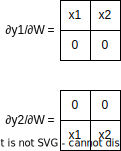

# UiNN

UiNN is a neural network batched forward and backward pass implementation in [Uiua](http://uiua.org).

Diagramatically, UiNN can run/train networks of the form:


    Where the linear and elementwise activation function are alternated (the last layer will always be a linear layer). Since this is a proof of concept, only the ReLU activation function is officially supported (however, changing the activation should be trivial as long as you update the gradient function for it as well). UiNN performs a [uniform Kaiming He style initialization](https://pytorch.org/docs/stable/nn.init.html#torch.nn.init.kaiming_uniform_) of all parameters (weights and biases). Specifically, model weights are initialized with fan-in uniform Kaiming He, while, biases are initialized with fan-out uniform Kaiming He (*note: this assumes ReLU activation for the gain factor*). The training is performed by using batched gradiend descent (although other more advanced optimizers such as Adam could be implemented relatively easily).

# Demo

Either install Uiua locally and run `uiua run main.ua`, or you can try the link below!

Example of using the library:

```uiua
~ "seqnn.ua" ~ BackProp Eval Forward Net PUb ResX SE

0.01           # set LR
[[1 0 0 1]]    # ys
⍉⋯⇡4           # xs
Net[2 8 8 1]   # define a net
⍥BackProp 1000 # run 1k bp cycles
⊙(⍥◌4) ⊙ResX ⊙◌PUb Forward # run the net on xs, and show predicted results
# should print something close to ys!
```

[Try it!](https://uiua.org/pad?src=0_13_0-dev_2__TU0g4oaQIOKKnigvK8OXKeKKmeKNiQpaZXJvcyDihpAgw5cwwrDilrMKRXllIOKGkCDiip49LuKHoQpIU3VtIOKGkCDijZzijYkowqQvKykKT25lc0xpa2Ug4oaQICsxw5cwCiMgYXJyIC0-IGFycltldmVuIGlkeHNdIGFycltvZGQgaWR4c10KVW56aXAg4oaQIOKKgyjilr184pa9wqwp4oqi4o2J4ouv4oeh4qe7LgoKSGVJbml0IOKGkCDDlzIuNDQ5NDg5NzQyN8O34oia4oeM4oqiOi0xw5cy4oi14ouF4pqC4oq4WmVyb3MKSGVJbml0YiDihpAgw5cyLjQ0OTQ4OTc0MjfDt-KImjpIZUluaXTiioI6MS4KSW5pdEwg4oaQIOKKnzriiKnilqHiioMoSGVJbml0YuKHjOKKoilIZUluaXQKRFJlTFUg4oaQIOKJpTAKIyBEUmVMVSDihpAgw5ctOjEuIMO3OjErMeKBvzplwq8KClBVYiDihpAgwrDilqHil4fiioPiiqIo4oaYMSkKTGluTCDihpAg4oqC4pah4oqZOuKNnOKIqeKNiSvCsOKWoeKKosKw4pahOk1NOuKIqcKw4pah4oqZUFVi4oqZUFViwrDilqHiipk64oqD4oqi4oiYClJlTCDihpAg4oqC4pah4peHw5c-MC7iiqIuCiMgUmVMIOKGkCDiioLilqHDtzoxKzHigb86ZcKvwrDilqHiiqIuCgojIHRvcG8gLT4gbmV0Ck5ldCDihpAg4omhSW5pdEziiaHih4zil6syCiMgbmV0IHhzIC0-IHlzIG5ldApSdW4g4oaQIOKKmeKXjExpbkzijaIoUmVMIExpbkx8PjHip7vCsOKWoTriipkuKeKKmS7CpOKWoToKIyBuZXQgeHMgeXMgbHIgLT4geXMgbmV0IHlzIGxyIHhzCkZvcndhcmQg4oaQIOKKmeKKmeKKmTriipniipk64oq4UnVuCiMgbmV0IHlzIGxyIHhzIC0-IG5ldCB4cyB5cyBscgpSZXNYIOKGkCDiipk64oqZ4oqZOgpFdmFsIOKGkCDiipnil4xQVWIgUnVuCgojIHkgeXMgbmV0IGV4cF95cyAtPiAgTGdyYWQgeXMgbmV0IGV4cF95cwpETVNFIOKGkCDDt-KKouKHjOKWsy4t4oqZOuKKmeKKmeKKuDoKCiMgZ3JhZCB5cyBuZXQgLT4gYmJncmFkcyBsYXllcmlucwpCQkdyYWRzIOKGkCAoCiAg4oqZ4omh4oqi4oqZOiAgICAgICAgICAgICAgICAgICAgICAgICAgICAgICAgICAgICAgICAjIHBpY2sgb3V0IGFsbCBXIG1hdHJpY2llcwogIOKKmeKKmShEUmVMVSBVbnppcCkgICAgICAgICAgICAgICAgICAgICAgICAgICAgICAjIHVuemlwIGFuZCBjYWxjdWxhdGUgcmVsdSBkZXJpdmF0aXZlcwogIOKKmSjijYniip8pwqTilqHiipko4oaYwq8xKSAgICAgICAgICAgICAgICAgICAgICAgICAgICAgICAgIyB0cmFzaCBmaXJzdCBsYXllciBzaW5jZSB3ZSBkb24ndCBuZWVkIHRvIGNhbGMgZ3JhZGllbnQgb2YgaW5wdXQKICDih4ziipnil4zijaIo4oqC4pahIMOXTU3ijYk64oip4oipwrDilqHCsOKWoSDiipnCsOKKn-KKmTriipPiioPiiqLiiJjiioMo4oqifOKGmDEpfD4w4qe7OuKKmS4pICMgc2NhbiB3aXRoIGluaXQgdmFsIG9mIHRoZSBvdXB1dCBncmFkaWVudCwgZWFjaCBzdGVwOiAoZ3JhZCBAIFcpICogUmVsdUdyYWQKKQojIGJiZ3JhZHMgbGF5ZXJpbnMgLT4gZHcgZGIKTGVhZkdyYWRzIOKGkCDiiaEo4oip4pah4oqDKE1NOuKNiXzii4XiiaFIU3VtKeKIqcKw4pahwrDiip8p4o2J4oqfOgojIGdyYWQgeXMgbmV0IC0-IGR3IGRiIHlzIG5ldApCYWNrd2FyZCDihpAgTGVhZkdyYWRz4oq4QkJHcmFkcwojIGR3IGRiIHlzIG5ldCBsciAtPiBuZXQgeXMKQXBwbHlHcmFkcyDihpAg4oeMK8OX4oqZOuKKmeKKmTrijYniip8KCiMgbmV0IHhzIHlzIGxyIC0-IG5ldCB4cyB5cyBscgpCYWNrUHJvcCDihpAgUmVzWOKKuEFwcGx5R3JhZHMgQmFja3dhcmQgRE1TRSBQVWIg4oqZ4oeMRm9yd2FyZAoKU0Ug4oaQIC8r4oG_Mi3iiKniiqLiipk6CiMgZW5kIHVpbm4gY29kZQoKIyBleGFtcGxlIGNvZGUKMC4wMSAgICAgICAgICAgICAgICAgICAgICAgIyBzZXQgTFIKW1sxIDAgMCAxXV0gICAgICAgICAgICAgICAgIyB5cwrijYnii6_ih6E0ICAgICAgICAgICAgICAgICAgICAgICAjIHhzCk5ldFsyIDggOCAxXSAgICAgICAgICAgICAgICMgZGVmaW5lIGEgbmV0CuKNpUJhY2tQcm9wIDEwMDAgICAgICAgICAgICAgIyBydW4gMWsgYnAgY3ljbGVzCuKKmSjijaXil4w0KSDiiplSZXNYIOKKmeKXjFBVYiBGb3J3YXJkICMgcnVuIHRoZSBuZXQgb24geHMsIGFuZCBzaG93IHByZWRpY3RlZCByZXN1bHRzCiMgc2hvdWxkIHByaW50IHNvbWV0aGluZyBjbG9zZSB0byB5cyEK)

## How UiNN Conceptually Works (Explanation of BP)

    Since Uiua is an array based stack language, it highly favors parallel operations that share minimal state (such as maps and tables). Explicitly looping should be avoided in favor of allowing the brodcasting operations to do implicit loops. Additionally, keeping the stack organized is incredibly important in keeping code succinct, since an unorganized stack will force many stack reordering operations to be used.

    Due to these considerations, I implemented a two pass approach for calculating the leaf gradients. The first pass computes the gradients along the backbone (this is also the path of the diameter of the tree) of the gradient tree. The second pass propagates the backbone gradients to each leaf. To understand this, let's take a look at the gradient tree and how to use it:


Note that each operation in the tradional model view (on the left) has an equivalent representation in the gradient tree. The direction of the edges in the gradient tree tell us which way to use the chain rule to calculate the derivative. Each box representes a vector (note this will later change, however, for now it is sufficient to consider this to be a vector). Note that Y<sub>0</sub> is the input to the network and Y<sub>3</sub> is the output of the network.

Now let's consider calculating the gradient along the backbone:


##### The Linear Layer

    To calculate ∂L/∂Y<sub>2</sub>, we need to backpropagate through the `Linear 2` node. Since we already know ∂L/∂Y<sub>3</sub> (this is the loss derivative), we can simply use the chain rule: ∂L/∂Y2 = ∂L/∂Y<sub>3</sub> * ∂Y<sub>3</sub>/∂Y<sub>2</sub>, where the muliplication here corresponds to a matrix multiplication and ∂Y<sub>3</sub>/∂Y<sub>2</sub>, is the jacobian of the linear layer (the analog for derivatives when dealing with vector valued functions). Recall the linear layer has the form Y<sub>3</sub>=W<sub>2</sub>Y<sub>2</sub> +b<sub>2</sub>. Then, we know that ∂Y<sub>3</sub>/∂Y<sub>2</sub>=W<sub>2</sub> (just like if we were dealing with scalar quantities: y=ax +b; dy/dx=a). So, we now know that the partial derivative of a linear layer's output w.r.t it's input is its own weight matrix, as well as, we can propagate through gradients through the gradient tree by using the chain rule and the jacobian we just calculated.

##### The Activiation Function

    Next we would want to calculate the derivative on the first linear layer. To do this, we must backpropagate through the `ReLU` node. The jacobian of the ReLU node is a bit more conceptually challenging, since its gradients depend on the input it recieved. Note that the definition of ReLU is y=max(0, x); where max represents an elementwise maximum between the vector x and the other scalar parameter (zero in ReLU's case). Since this is an elementwise activation function, we know the jacobian **must** be diagonal (since other an element depends only on one element in the input vector*). Then we know that each diagonal entry must be either 0, 1: 0 if the value was negative, and 1 if the value was positive. So the jacobian should be equal to: ∂y/∂x = diag(x≥0).

\* Actually this is a necessary but not sufficent condition, since we could consider a operation which permutes values. This would give us a jacobian which is a permuted identity matrix, which would not necessarily be diagonal. The more specific condition is that element-wise operations imply that for an input vector x, the resulting vector looks like: y<sub>i</sub>=f(x<sub>i</sub>), note the matching indicies.

##### The Whole Backbone

    Since we can calculate the jacobians of each operation on the backbone, we can multiply through the output loss gradient and find gradients ∂L/∂Y<sub>n</sub>.

### The Leaves (Linear Layers)


    Now we have all the gradients along the backbone (∂L/∂Y<sub>n</sub>), we can start calculating the gradients induced on the leaves on the trees. Notice that the only operations which have leaves (excluding the neural net input) are the linear operations. Also notice that the leaves correspond to parameters that we would like to update (the green nodes). Additionally, recall that the arrows in the gradient tree corresponds to using the chain rule. So the critical task is to find all of the jacobians.

##### The Bias

    Recall, the linear layer has the form y = Wx +b. We can simply calclulate the jacobian directly ∂y/∂b = I (one inuitive way to think of this is that b has an implicit identity matrix to the left so the answer would be the idenity matrix). Since the jacobian is the identity matrix, we know that the update to the bias will be proportional to the gradient on the linear layer. So the update for b<sub>2</sub> should look like: b<sub>2</sub> += -η*(∂L/∂Y<sub>3</sub>), where η is the learning rate. The negative is because the gradient points towards the steepest ascent, but we want to decrease the loss.

##### The Weight

    Now we need to back propagate to the weight, or follow the arrow backwards from the linear node to the W node to find ∂L/∂W. Recall that traversing the arrows requires calculating the jacobian, however, note that ∂Y/∂W cannot possibly be a jacobian since it obviously cant be a matrix, since unlike earlier where both the thing being differentiated (y in our case) is a vector and the variable we are differentiating with respect to (b in the last case). Unfortunately we've hit a tensor, however don't fret since this tensor has a trivial structure we will later exploit.

    To understand what this tensor will look like, let's go step by step and examine this tensor with a worked example:

First, consider the 2x2 case:


then, expand the y vector:


Let's break the derivative up across components of y (this will make later computations easier):



Notice that each derivative wrt to y<sub>i</sub> only depends on W<sub>ij</sub>, where j is the index of the vector, meaning our tensor looks like stacked copies where each cross section along y<sub>i</sub> is just x<sup>T</sup> in the ith row. This is written as x<sup>T</sup> ⊗ I. Eventually we will want to calculate the update to the weight based on the upstream gradient e.g. how we should change W<sub>2</sub> based on the gradient ∂L/∂Y<sub>3</sub>. To accomplish this we need to perform a tensor contraction between the gradient and the tensor. What this looks like in practice is a weighted sum of the matricies ∂y<sub>i</sub>/∂W weighted by the ith component of the upstream gradient e.g. (∂L/∂Y<sub>3</sub>)<sub>i</sub>, or written formally:


Or more visually (in the 2x2 case):


However, notice that this exactly corresponds to an outer product, namely the outer product: (∂L/∂y)x<sup>T</sup>. So finally, we know that the update for the weight should look like: W<sub>2</sub> += -η*(∂L/∂Y<sub>3</sub>)Y<sub>2</sub><sup>T</sup>.

### Putting it All Together

    Here's a pseudo code implementation of these concepts for the neural net in the first diagram (two linear layers and one ReLU between them):

```
# first run the network forward
y0 = <column vector input>
y1 = W1 @ y0 +b1
y2 = relu(y1)
y3 = W2 @ y2 +b2

# get gradient from loss function
∂L/∂y3 = backward_loss(y3, expected_y)

# calculate gradient along the rest of the backbone
∂L/∂y2 = ∂L/∂y3 @ W2
∂L/∂y1 = ∂L/∂y2 @ relu_jacobian(y1) # recall this will just be diag(y1 ≥ 0)
# notice we do not calculate the gradient ∂L/∂y0, since we have no use for it

# calculate gradients on leaves of grad tree
∂L/∂b2 = ∂L/∂y3
∂L/∂W2 = ∂L/∂y3 @ y2.T

∂L/∂b1 = ∂L/∂y1
∂L/∂W1 = ∂L/∂y1 @ y0.T

# finally we update the weights
b2 += -η ∂L/∂b2
W2 += -η ∂L/∂W2

b1 += -η ∂L/∂b1
W1 += -η ∂L/∂W1
```

This is a numpy like syntax where `@` denotes matrix multiplication and `.T` denotes the transpose. `η` is the learning rate.

### Batching the Forwards and Backwards Passes

    Theoretically, we could run the passes above independently and accumulate all of the parameter updates and apply them after iterating through the entier dataset (or batch)*****. In practice this is pretty bad advice, since it's better to have BLAS handle the heavy lifting for these kind of loops. Trust me (and an [anecdotal story](https://stackoverflow.com/questions/1303182/how-does-blas-get-such-extreme-performance)), you will not write a faster implementation. Additionally, doing batching correctly will improve cache locality.

##### The Forward Pass

    As usual, as to not scare anyone off, we first start with the easier case, namely, the forward pass. The forward pass can be trivially BLASed, mainly by just replace y0 (the input vector), with a matrix. This can be done by appending the column vectors together:


Where x<sub>1</sub> denotes input 1 to the network, not the first component of the vector x and Y<sub>0</sub> is the input to the net.

Additionally, we need to make sure that the ReLU function now works with matricies, however, the fundamental operation is the same, except elementwise across each matrix entry. Other than these small modifications, everything should work as expected!

***** note: For batched gradient descent we don't update the weights after every sample, since that would be SGD. Instead, we accumulate all the updates and after iterating through all samples in the batch, we apply the all the updates at once. The intuition to why this is better is that we get a better gradient estimate if we consider multiple samples and then take a step in the lower loss direction, rather than, taking a step after each sample (for example: maybe this sample is an outlier and will cause a step in the wrong direction).

##### The Backward Pass

    Now that we have the forward pass working, time to get the backward pass working! Firsly, we will use the same strategy with the gradients, namely, we will concatenate the gradient column vectors together, just like we did for the input vectors. Secondly, we will need to reconsider all of the jacobians. To start let's go through the backbone again.

    For the linear layer, it's mostly the same since our weight matrix does not change while processing the batch. Using the same logic as the forward pass, we know that we can just muliply our concatenated gradients by the jacobian (since it will also not change per sample).

    For the ReLU layer, it becomes a bit more difficult. Note that the jacobians are *not* the same, since the jacobian depends on the input. So, for every input, we will have a unique jacobian, however, recall from earlier that the jacobian is diagonal. Also note that a matrix multiplication of the form diag(z)x, where z is some vector is equivalent to z*x, where the asterisk denotes the elementwise multiplication. If we record only the diagonals for each jacobian, instead of doing some complicated tensor contraction, we can do an elementwise multiplication between the matrix of gradients and the matrix of diagonal elements.

    Finally we can move onto the leaves of the gradient tree. For the bias leaf the idea is pretty simple, since in batched gradient descent we accumulate the changes, we can just accumulate the gradients (e.g. do a sum across the columns of the gradient matrix). For the weight, the solution is also surprisingly simple, we can use the exact same formula (∂L/∂y)X<sup>T</sup>, where X is now a matrix of inputs. This is the case because this matrix multiplication can be viewed as a sum of outer products.

TODO: visualize?

### Putting it Together (Batched Forward & Backward)

```
# first run the network forward
Y0 = <matrix input with each sample being a column vector>
Y1 = W1 @ Y0 +b1
Y2 = relu(Y1)
Y3 = W2 @ Y2 +b2

# get gradient from loss function
∂L/∂Y3 = backward_loss(Y3, expected_Y)

# calculate gradient along the rest of the backbone
∂L/∂Y2 = ∂L/∂Y3 @ W2
∂L/∂Y1 = ∂L/∂Y2 @ relu_diagjacobian(Y1) # this will just be Y1 ≥ 0 (the diagonal of the jacobian)
# notice we do not calculate the gradient ∂L/∂Y0, since we have no use for it

# calculate gradients on leaves of grad tree
∂L/∂b2 = hsum(∂L/∂Y3) # horizontally sum across column vectors
∂L/∂W2 = ∂L/∂Y3 @ Y2.T

∂L/∂b1 = hsum(∂L/∂Y1) # horizontally sum across column vectors
∂L/∂W1 = ∂L/∂Y1 @ Y0.T

# finally we update the weights
b2 += -η ∂L/∂b2
W2 += -η ∂L/∂W2

b1 += -η ∂L/∂b1
W1 += -η ∂L/∂W1
```

## How UiNN is Implemented

    What next follows is a high level overview of how this is all implemented in UiNN.

##### The Utility Functions

First we define a set of utility functions, the main one being the matrix multiplication:

```uiua
MM ← ⊞(/+×)⊙⍉
```

    First, note that `/+×` is equivalent to the dot product. Next, note that the table modifier applies the function to all combinations of rows of two arrays (think like a cartesian product that evaluates a function on the tuples). Since we want to implement matrix multiplication, we need to transpose the second matrix such that the columns become rows, and then the table dot product returns the correct result.

```uiua
Unzip ← ⊃(▽|▽¬)⊢⍉⋯⇡⧻.
```

    This function takes an input array and splits it into two arrays: one containing all elements with even indices and one containing all elements with odd indices.

```
PUb ← °(□⊂□)
```

    This is a important function for dealing with arrays as stacks. It takes an array (which is possibly boxed itself and contains boxed elements) and pops off the first element, returning an unboxed copy of the element and the rest of the array.

##### Init Functions

    First, and most importantly, we have the `InitL` and `Net` functions, which instantiates a linear layer of the neural network and the neural network itself respectively. Note that in UiNN, a neural network is represented as an array of tuples of layer weights and biases.

```
InitL ← ⊟∩□⊃HeInit(HeInitb⇌⊢)
```

    Here we use both the `HeInit` and `HeInitb`, that will generate the weights and biases respectively (we don't go in depth of the implementation of these functions, but know they do uniform Kaiming He init as described in the summary above). We then box both of these items (since Uiua doesn't allow unboxed jagged arrays). Finally, we combine these into a containing array using a couple.

```
Net ← ≡InitL≡⇌◫2
```

    For the `Net`, we will take in a topology array of the form `[num_in, hidden_1, ..., hidden_n, num_out]`. Where `hidden_i` denotes the vector size of the hidden layer. To construct a layer, we then need to look at a sliding window of size 2 and generate the in and out size for each layer. However, the elements of the tuple need to be swapped, since the moving window will generate size tuples like `[in, out]`, when the weight matrix size, `HeInit`, and `HeInitb` expect `[out, in]`, so we first reverse all rows (e.g. swap columns), and then apply `InitL` to each `[out, in]` tuple to initalize parameters for each linear layer.

##### Forward

    Finally, we have our neural net initialized, so it comes time to run the network with some input data! To do this, UiNN implements forward passes for linear layers and ReLU layers in `LinL` and `ReL` respectively. Since inputs need to be recorded so that we can evaluate the derivative functions in the backward pass, all forward functions operate on a stack, where we peek the latest item, apply the operation, and then push the result.

```
LinL ← ⊂□⊙:⍜∩⍉+°□⊢°□:MM:∩°□⍥⊙PUb2°□⊙:⊢.
```

    `⊢.` fetches the first item of the output stack (namely the last value that we calculated for the previous layer). `∩°□⍥⊙PUb2` prepares the weight to be matrix multiplied as well as the bias vector. Then we do a matrix muliply, and the bias addition (under a transpose since Uiua brodcasts along rows): `⍜∩⍉+°□⊢°□:MM:`. Finally we run `⊂□⊙:` which brings the output stack up and appends the new item to the front of the stack.

       `ReL` acts similarly to  `LinL` except it applies the ReLU activation function and pushes the result to the stack.

```
ReL ← ⊂□◇×>0.⊢.
```

    `⊢.` fetches the previous output. `×>0.` is the implementation of the relu function in Uiua. Note the `◇` modifier which will automatically unbox, apply the operation, and then re-boxes the result. Finally we `⊂□` to add the new result to the stack.

    The `Run` function combines all these elements to run a forward pass on the neural network.

```
Run ← ⊙◌LinL⍢(ReL LinL|>1⧻°□:⊙.)⊙.¤□:
```

First we box the input to the network `¤□:` (this is so that later we can add it onto the stack). Next we `⊙.`, which copies the neural net (this is because the forward pass will consume all the weights as we do forward passes on the linear layers). Then we repeat while `1⧻°□:⊙.` (we have more than 1 layer), run the linear forward pass (`LinL`) and ReLU forward pass (`ReL`). Finally we run the output linear layer `LinL`, and pop the empty net `⊙◌` (since we consumed all the weights).

##### Backward

    Now that we have calculated the forward pass, we need to update the neural network with the backwards pass. To do this, I follow the backpropagation tutorial from above closely. The key functions here are `DMSE`, `Backward`, and `ApplyGrads`.

    The `DMSE` function calculates the <u>negative</u> gradient of the mean squared error (MSE) loss function when evaluated on the neural network predicted outputs and the supplied expected outputs. We compute the negative gradient because the weight update is applied in the opposite direction of the gradient (updating in the other direction would increase the loss instead).

```
DMSE ← ÷⊢⇌△.-⊙:⊙⊙⊸:
```

    `⊙:⊙⊙⊸:` grabs a copy of the expected outputs. The `-` calculates the negative gradient (actually we are missing a factor of 2, but this can be absorbed into the learning rate). The expression `⊢⇌△.` calculates the number of samples in the batch and `÷` scales all the updates by 1/batch_size (which provides the correct gradient for mean squared error).

    The `Backward` function first calculates the backbone gradients and then all the gradients on the leaf nodes of the grad tree.

```
Backward ← LeafGrads⊸BBGrads
```

    `BBGrads` calculates the gradients along the back bone of the grad tree. This is done in a similar approach to the forward pass, in which we keep, in this case, a stack of gradients along the backbone. The definition of `BBGrads` looks like:

```
BBGrads ← (
  ⊙≡⊢⊙:
  ⊙⊙(DReLU Unzip)
  ⊙(⍉⊟)¤□⊙(↘¯1)
  ⇌⊙◌⍢(⊂□ ×MM⍉:∩∩°□ ⊙°⊟⊙:⊓⊃⊢∘⊃(⊢|↘1)|>0⧻:⊙.)
)
```

    `⊙≡⊢⊙:` picks out all the weight matricies of of the neural network (since the result of back bone gradient computations only rely on the weight matrix values, not the biases). Then we `⊙⊙(DReLU Unzip)` which splits the inputs into two arrays: inputs which to linear layers and inputs to ReLU layers. It also immediately calculates the matrix containing the diagonals of the ReLU jacobians. Then we `⊙(↘¯1)`, which drops the output of the neural network and `⊙(⍉⊟)¤□` which pairs up the ReLU gradients and weights so we can iterate through them. Then we iterate while `>0⧻:⊙.` (iterate through all the ReLU gradient and weight matrix pairs). We do `⊃(⊢|↘1)`, to pop off a ReLU gradient and weight matrix tuple. Additionally, we `⊃⊢∘`, which pops the latest gradient off of the stack. We then do some stack operations and unboxing `:∩∩°□ ⊙°` Next, we do the matrix product with the linear layer weight matrix and the gradient `×MM⍉`. Finally, we push it back onto the gradient stack (`⊂□`). We then `⊙◌` pop the empty ReLU gradient and weight matrix tuple list and `⇌` reverse the calculated gradients (since we calculated them from back to front and we will later need to have them ordered front to back to match the network weight bias tuple order).

    `LeafGrads` calculates the gradients on the leaves of the gradient tree using the backbone gradients:

```
LeafGrads ← ≡(∩□⊃(MM:⍉|⋅≡HSum)∩°□°⊟)⍉⊟:
```

    First we `⍉⊟:`, which creates tuples of linear layer inputs and the induced gradient on them. Next, for each pair we `∩°□°⊟` which breaks the tuple apart and unboxes both items. We then use a fork to calculate `MM:⍉`, the weight matrix gradient and `⋅≡HSum`, the sum of the gradient vectors (which is the gradient on the bias vector).

    `ApplyGrads` applies the gradients calculated in the `LeafGrads` to the neural network parameters.

```
ApplyGrads ← ⇌+×⊙:⊙⊙:⍉⊟
```

    `⍉⊟` merges the bias and weight gradients. This will create a list of dw and db tuples (which has the same shape as the neural network object). Next we fetch and multiply our net delta by the learning rate `×⊙:⊙⊙:`. Finally we `⇌+` apply the gradient update and fix the ordering of the layers.

## Ending Notes

   I hope you found Uiua interesting or gained some insight into backpropagation!